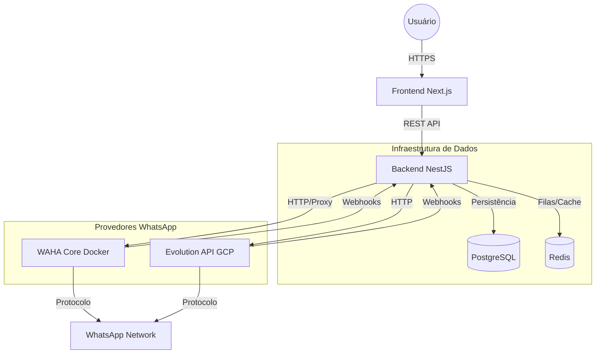

# 📊 Relatório Geral do Projeto - WhatSaas

**Data do Relatório:** 11 de Janeiro de 2026
**Status Geral:** 🟢 Fase de Estabilização / Pré-Produção
**Versão:** 1.0.0-beta

---

## 1. 📝 Visão Geral e História

O **WhatSaas** é uma plataforma SaaS Enterprise para automação e marketing no WhatsApp, utilizando uma arquitetura híbrida inovadora que combina a estabilidade da API Oficial (Meta) com a flexibilidade de APIs não-oficiais (Evolution API e WAHA).

O projeto evoluiu de uma simples ferramenta de disparo para um ecossistema completo com gestão de múltiplas instâncias, editor de fluxos visual (estilo n8n/Typebot) e capacidades de IA generativa.

### 📅 Linha do Tempo Resumida

- **Sessões Iniciais (Dez/2025):** Definição da stack (NestJS + Next.js), setup do Docker e implementação da autenticação JWT Multi-tenant.
- **Integração WAHA:** Implementação do primeiro adaptador de WhatsApp, rodando localmente via Docker. Descoberta a limitação de sessão única da versão Core.
- **Expansão Híbrida:** Decisão de integrar **Evolution API** para escalar com múltiplas instâncias. Implementação do `WhatsAppProviderFactory` no backend para alternar fornecedores dinamicamente.
- **Infraestrutura Cloud:** Deploy da Evolution API no Google Cloud Platform (GCP) para garantir estabilidade e IP dedicado (VM `whatsaas-vm`).
- **Editor de Fluxos (Jan/2026):** Desenvolvimento pesado no Frontend do "Flow Editor", incluindo nós complexos (IA, Webhooks, Condicionais) e sistema de pastas.
- **Segurança e Proxy (Jan/2026):** Implementação de Proxy Reverso Blindado no backend para acessar painéis administrativos (WAHA/Evolution) sem expor portas publicamente.

---

## 2. 🏗️ Arquitetura do Sistema

O sistema segue uma arquitetura de microserviços simplificada via Docker Compose, com o Backend NestJS atuando como orquestrador central.

### 🔄 Fluxograma Macroscópico

### 📂 Estrutura de Código

#### Backend (NestJS)
- **`/src/modules/auth`**: Sistema de login, registro e Guards (JWT, Roles).
- **`/src/modules/instances`**: Gerenciamento de sessões WhatsApp (CRUD).
- **`/src/modules/whatsapp`**: Coração do sistema. Contém a lógica de adaptadores (`EvolutionAdapter`, `WahaAdapter`) e Factory.
- **`/src/modules/flows`**: Lógica do construtor de fluxos e nós.
- **`/src/modules/admin-panels`**: Proxy reverso de segurança para ferramentas internas.

#### Frontend (Next.js)
- **`/app/(dashboard)`**: Área logada com Sidebar persistente.
- **`/app/flows/[id]`**: Editor visual de fluxos (React Flow).
- **`/components/nodes`**: Componentes visuais de cada nó do fluxo (Texto, Áudio, IA, etc.).

---

## 3. ✅ O Que Já Foi Implementado (100% Funcional)

As seguintes funcionalidades estão completas e testadas:

### 🔐 Autenticação e Segurança
- [x] Login e Registro com JWT.
- [x] Proteção de rotas por Roles (User, Admin, SuperAdmin).
- [x] **Proxy Reverso Seguro**: Acesso a `/admin/panels/waha` e `/evolution` autenticado via backend.

### 📱 Gestão de Instâncias
- [x] Criação de instâncias para WAHA e Evolution.
- [x] Exibição de QR Code em Tempo Real (Polling/Websocket).
- [x] Status da conexão (CONNECTED, PAIRING, DISCONNECTED).
- [x] Exclusão e desconexão de instâncias.

### 🔄 Editor de Fluxos (Flow Builder)
- [x] Interface Drag & Drop moderna.
- [x] Sistema de organização por Pastas.
- [x] Nós Básicos: Texto, Imagem, Vídeo, Áudio.
- [x] Nós Avançados: Integração IA (LLMs), Webhook, Botões e Listas.
- [x] Persistência dos fluxos no Banco de Dados.

### ⚙️ Infraestrutura e DevOps
- [x] Docker Compose completo (Postgres, Redis, WAHA, Evolution Local).
- [x] Deploy da Evolution API no Google Cloud (GCP) operacional.
- [x] Banco de dados isolado para a Evolution API (evitando conflitos de migração).

---

## 4. 🚧 O Que Falta Implementar / Em Progresso

Funcionalidades planejadas ou parcialmente iniciadas que **NÃO** estão 100% prontas para uso em escala.

### 📨 Motor de Disparo em Massa (Campanhas)
- **Estado Atual:** 30% (Estrutura existe, mas lógica de fila complexa falta).
- **Falta:**
  - Implementar BullMQ (Redis) para fila de disparo robusta.
  - Lógica de "Round-Robin" (rodízio) entre instâncias disponíveis.
  - Rate Limiting (atraso inteligente entre mensagens para evitar ban).

### 🤖 Integração IA Real
- **Estado Atual:** 50% (Interface de configuração de chaves existe).
- **Falta:** 
  - Conectar o nó de IA do fluxo à API da OpenAI/Anthropic real no backend durante a execução do fluxo.
  - Contexto de conversa (memória do chat).

### 📊 Dashboards e Relatórios
- **Estado Atual:** 20% (Layout existe).
- **Falta:** 
  - Gráficos reais conectados ao banco de dados (Mensagens enviadas, entregues, lidas).
  - Webhooks de status de mensagem (ACKs) sendo processados e salvos.

---

## 5. 🚀 Pendências para Deploy (Go-Live)

Para colocar o projeto em produção (acessível ao público final):

1. **Configuração de Domínio e SSL:**
   - Apontar domínio (ex: `app.whatsaas.com.br`) para o IP da VPS/GCP.
   - Configurar Nginx/Traefik com Certbot para HTTPS.

2. **Segurança de Variáveis de Ambiente:**
   - Substituir os secrets gerados temporariamente no `.env.production` por chaves definitivas.
   - Rotacionar chaves da API do Evolution/WAHA.

3. **Validação do Fluxo "Ponta a Ponta":**
   - Realizar um teste final: Criar conta nova -> Conectar WhatsApp -> Criar Fluxo -> Disparar para 100 contatos -> Verificar relatório.

4. **Sistema de Pagamento (Billing):**
   - **CRÍTICO:** Ainda não há integração com gateway de pagamento (Stripe/Asaas) para cobrar dos usuários pelo uso (SaaS).

---

## 6. 🔮 Roadmap Futuro (Pós-MVP)

- **App Móvel:** Versão simplificada para gestão via celular.
- **Warmup Automático:** Sistema que "aquece" chips novos trocando mensagens entre si automaticamente.
- **Marketplace de Fluxos:** Usuários compartilharem templates de fluxos prontos.

---

**Conclusão:** O WhatSaas está tecnicamente robusto e muito próximo de um MVP funcional. O foco imediato deve ser o **Motor de Disparo (Filas)** e a **Integração Real da IA**, seguidos pelo setup de domínio para lançamento.
