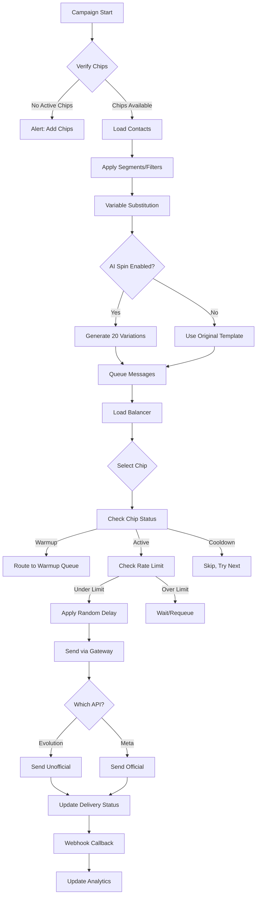

# WhatSaas - Arquitetura do Sistema

> SaaS Multi-tenant para WhatsApp Marketing Híbrido com IA

## 🎯 Visão Geral

Sistema de marketing automatizado para WhatsApp que integra:
- **API Oficial Meta** (transacionais, notificações, alta confiabilidade)
- **API Não-Oficial** (campaigns em massa, múltiplas instâncias)
- **AI Engine** (geração de conteúdo dinâmico, anti-spam)
- **Anti-Ban System** (warm-up, maturação, simulação humana)

---

## 🏗️ Arquitetura de Alto Nível

```
┌─────────────────────────────────────────────────────────────────────────────┐
│                              FRONTEND (Next.js)                              │
│  ┌─────────────┐  ┌─────────────┐  ┌─────────────┐  ┌─────────────────────┐ │
│  │  Dashboard  │  │  Campaigns  │  │  Templates  │  │   Proxy Manager     │ │
│  │  Real-time  │  │   Editor    │  │   Builder   │  │   + Chip Status     │ │
│  └─────────────┘  └─────────────┘  └─────────────┘  └─────────────────────┘ │
└────────────────────────────────────────┬────────────────────────────────────┘
                                         │ REST/WebSocket
                                         ▼
┌─────────────────────────────────────────────────────────────────────────────┐
│                            API GATEWAY (Kong/Custom)                         │
│              Rate Limiting │ Auth │ Tenant Isolation │ Logging              │
└────────────────────────────────────────┬────────────────────────────────────┘
                                         │
         ┌───────────────────────────────┼───────────────────────────────┐
         ▼                               ▼                               ▼
┌─────────────────┐            ┌─────────────────┐            ┌─────────────────┐
│   AUTH SERVICE  │            │   CORE SERVICE  │            │  AI SERVICE     │
│  (Multi-tenant) │            │   (Campaigns)   │            │  (LLM Engine)   │
│                 │            │                 │            │                 │
│ • JWT/OAuth2    │            │ • CRUD Campaigns│            │ • OpenAI        │
│ • Tenant Mgmt   │            │ • Contacts Mgmt │            │ • Anthropic     │
│ • Subscriptions │            │ • Templates     │            │ • Llama Local   │
│ • Billing       │            │ • Analytics     │            │ • Spinner       │
└─────────────────┘            └────────┬────────┘            └────────┬────────┘
                                        │                              │
                                        ▼                              ▼
┌─────────────────────────────────────────────────────────────────────────────┐
│                           DISPATCHER ENGINE (Core)                           │
│  ┌─────────────────────────────────────────────────────────────────────────┐│
│  │                         MESSAGE QUEUE (Redis/Bull)                       ││
│  │   ┌──────────┐  ┌──────────┐  ┌──────────┐  ┌──────────┐               ││
│  │   │ Priority │  │  Normal  │  │ Warmup   │  │  Retry   │               ││
│  │   │  Queue   │  │  Queue   │  │  Queue   │  │  Queue   │               ││
│  │   └──────────┘  └──────────┘  └──────────┘  └──────────┘               ││
│  └─────────────────────────────────────────────────────────────────────────┘│
│                                      │                                       │
│  ┌───────────────────────────────────┼───────────────────────────────────┐  │
│  │                        LOAD BALANCER (Round-Robin)                     │  │
│  │                                                                        │  │
│  │   ┌─────────────┐  ┌─────────────┐  ┌─────────────┐  ┌─────────────┐  │  │
│  │   │   Chip 1    │  │   Chip 2    │  │   Chip 3    │  │   Chip N    │  │  │
│  │   │  (Active)   │  │  (Warmup)   │  │  (Cooldown) │  │  (Ready)    │  │  │
│  │   │ Proxy: A    │  │ Proxy: B    │  │ Proxy: C    │  │ Proxy: D    │  │  │
│  │   └──────┬──────┘  └──────┬──────┘  └──────┬──────┘  └──────┬──────┘  │  │
│  │          │                │                │                │         │  │
│  └──────────┼────────────────┼────────────────┼────────────────┼─────────┘  │
│             ▼                ▼                ▼                ▼            │
│  ┌─────────────────────────────────────────────────────────────────────────┐│
│  │                         RATE LIMITER                                     ││
│  │          Random Delays (15-60s) │ Per-Chip Limits │ Backoff             ││
│  └─────────────────────────────────────────────────────────────────────────┘│
└──────────────────────────────────────┬──────────────────────────────────────┘
                                       │
         ┌─────────────────────────────┼─────────────────────────────┐
         ▼                             ▼                             ▼
┌─────────────────┐          ┌─────────────────┐          ┌─────────────────┐
│  EVOLUTION API  │          │   META WABA     │          │  PROXY MANAGER  │
│   (Unofficial)  │          │   (Official)    │          │   (Socks5)      │
│                 │          │                 │          │                 │
│ • Multi-Instance│          │ • Templates     │          │ • Rotation      │
│ • Sessions      │          │ • Verified      │          │ • Health Check  │
│ • Webhooks      │          │ • High Trust    │          │ • Geo-Location  │
└─────────────────┘          └─────────────────┘          └─────────────────┘
```

---

## 📦 Estrutura de Domínios (DDD)

### Bounded Contexts

```
┌─────────────────────────────────────────────────────────────────┐
│                        IDENTITY CONTEXT                          │
│  • Tenant (Empresa)                                              │
│  • User (Usuário)                                                │
│  • Subscription (Plano)                                          │
│  • Billing (Faturamento)                                         │
└─────────────────────────────────────────────────────────────────┘

┌─────────────────────────────────────────────────────────────────┐
│                       CAMPAIGN CONTEXT                           │
│  • Campaign (Campanha)                                           │
│  • Template (Modelo de Mensagem)                                 │
│  • Contact (Contato)                                             │
│  • Segment (Segmento)                                            │
│  • Variable (Variável Dinâmica)                                  │
└─────────────────────────────────────────────────────────────────┘

┌─────────────────────────────────────────────────────────────────┐
│                       DISPATCH CONTEXT                           │
│  • Message (Mensagem)                                            │
│  • Delivery (Entrega)                                            │
│  • Chip (Número WhatsApp)                                        │
│  • Instance (Instância Evolution/Meta)                           │
│  • Schedule (Agendamento)                                        │
└─────────────────────────────────────────────────────────────────┘

┌─────────────────────────────────────────────────────────────────┐
│                     INFRASTRUCTURE CONTEXT                       │
│  • Proxy (Proxy Socks5)                                          │
│  • Warmup (Maturação)                                            │
│  • HealthCheck (Monitoramento)                                   │
│  • Analytics (Métricas)                                          │
└─────────────────────────────────────────────────────────────────┘

┌─────────────────────────────────────────────────────────────────┐
│                          AI CONTEXT                              │
│  • LLMProvider (OpenAI/Anthropic/Llama)                         │
│  • ContentSpin (Variações Semânticas)                           │
│  • PromptTemplate (Templates de Prompt)                         │
│  • Generation (Resultado de Geração)                            │
└─────────────────────────────────────────────────────────────────┘
```

---

## 🔧 Stack Técnica

### Backend
| Componente | Tecnologia | Justificativa |
|------------|------------|---------------|
| Framework | **NestJS** (Node.js) | TypeScript, modular, enterprise-ready |
| Database | **PostgreSQL** | ACID, multi-tenant, JSON support |
| Cache/Queue | **Redis + Bull** | Pub/Sub, filas de jobs, rate limiting |
| Gateway WhatsApp | **Evolution API** | Open-source, multi-instance, webhooks |
| API Oficial | **Meta Cloud API** | Templates aprovados, alta confiabilidade |

### Frontend
| Componente | Tecnologia | Justificativa |
|------------|------------|---------------|
| Framework | **Next.js 14** | SSR, App Router, performance |
| UI Library | **Shadcn/UI** | Componentes modernos, customizáveis |
| State | **Zustand + React Query** | Simples, performático |
| Real-time | **Socket.io** | Dashboard em tempo real |
| Charts | **Tremor** | Dashboard analytics |

### AI Engine
| Componente | Tecnologia | Justificativa |
|------------|------------|---------------|
| OpenAI | **GPT-4o** | Alta qualidade de geração |
| Anthropic | **Claude 3.5 Sonnet** | Alternativa de fallback |
| Local | **Llama 3.1** (Ollama) | Custo zero, privacidade |

### Infraestrutura
| Componente | Tecnologia | Justificativa |
|------------|------------|---------------|
| Containers | **Docker + Compose** | Padronização, deploy simples |
| Orchestration | **Docker Swarm / K8s** | Escalabilidade |
| Proxy Manager | **Custom + 3proxy** | Rotação de IPs |
| Monitoring | **Grafana + Prometheus** | Observabilidade |

---

## 🚀 Dispatcher Engine - Fluxo de Disparo



---

## 🛡️ Sistema Anti-Ban (Warm-up)

### Estratégias Implementadas

1. **Simulação Humana**
   - Eventos "digitando..." proporcional ao tamanho da mensagem
   - Eventos "gravando áudio" para mensagens de voz
   - Delays naturais entre ações

2. **Maturação Progressiva (Rampa)**
   - Dia 1-3: 10 mensagens/dia
   - Dia 4-7: 25 mensagens/dia
   - Dia 8-14: 50 mensagens/dia
   - Dia 15+: 100+ mensagens/dia

3. **Conversas Automáticas**
   - Chips da rede conversam entre si
   - Simulação de grupos de família/trabalho
   - Mensagens variadas (texto, imagem, áudio)

4. **Rotação de Proxies**
   - 1 Proxy por Chip (obrigatório)
   - Geo-matching (proxy BR para chip BR)
   - Health check automático

---

## 📊 Modelo de Dados (Simplificado)

```sql
-- Multi-tenant
CREATE TABLE tenants (
    id UUID PRIMARY KEY,
    name VARCHAR(255),
    slug VARCHAR(100) UNIQUE,
    plan_id UUID,
    created_at TIMESTAMP
);

-- Chips (Números WhatsApp)
CREATE TABLE chips (
    id UUID PRIMARY KEY,
    tenant_id UUID REFERENCES tenants(id),
    phone VARCHAR(20),
    instance_id VARCHAR(100),  -- Evolution API instance
    status ENUM('warmup', 'active', 'cooldown', 'banned'),
    proxy_id UUID REFERENCES proxies(id),
    warmup_day INT DEFAULT 0,
    daily_count INT DEFAULT 0,
    created_at TIMESTAMP
);

-- Campanhas
CREATE TABLE campaigns (
    id UUID PRIMARY KEY,
    tenant_id UUID REFERENCES tenants(id),
    name VARCHAR(255),
    template_id UUID,
    status ENUM('draft', 'scheduled', 'running', 'paused', 'completed'),
    ai_spin_enabled BOOLEAN DEFAULT true,
    scheduled_at TIMESTAMP,
    created_at TIMESTAMP
);

-- Mensagens na Fila
CREATE TABLE messages (
    id UUID PRIMARY KEY,
    campaign_id UUID REFERENCES campaigns(id),
    contact_id UUID REFERENCES contacts(id),
    chip_id UUID REFERENCES chips(id),
    content TEXT,
    variation_index INT,  -- Qual variação do AI spin
    status ENUM('queued', 'sending', 'sent', 'delivered', 'read', 'failed'),
    sent_at TIMESTAMP,
    delivered_at TIMESTAMP,
    read_at TIMESTAMP
);

-- Proxies
CREATE TABLE proxies (
    id UUID PRIMARY KEY,
    tenant_id UUID REFERENCES tenants(id),
    host VARCHAR(255),
    port INT,
    username VARCHAR(100),
    password VARCHAR(100),
    type ENUM('socks5', 'http'),
    country VARCHAR(2),
    is_active BOOLEAN DEFAULT true
);
```

---

## 🔐 Segurança Multi-tenant

```
┌─────────────────────────────────────────────────────────────┐
│                    REQUEST FLOW                              │
│                                                             │
│  1. JWT Token → Extract tenant_id                           │
│  2. RLS (Row Level Security) → Filter all queries           │
│  3. API Gateway → Rate limit per tenant                     │
│  4. Audit Log → Track all actions                           │
└─────────────────────────────────────────────────────────────┘
```

### Row Level Security (PostgreSQL)
```sql
-- Política de isolamento por tenant
CREATE POLICY tenant_isolation ON campaigns
    FOR ALL
    USING (tenant_id = current_setting('app.current_tenant')::uuid);
```

---

## 📈 Próximos Passos

1. **Setup do Projeto** - Estrutura NestJS + Next.js
2. **Módulo de Auth** - Multi-tenant com JWT
3. **Integração Evolution API** - Gestão de instâncias
4. **Dispatcher MVP** - Envio básico com filas
5. **AI Spinner** - Integração OpenAI
6. **Dashboard** - Visualização básica
7. **Warm-up System** - Maturação automatizada

---

> 📝 **Nota**: Esta arquitetura será refinada conforme os prompts adicionais do usuário.
