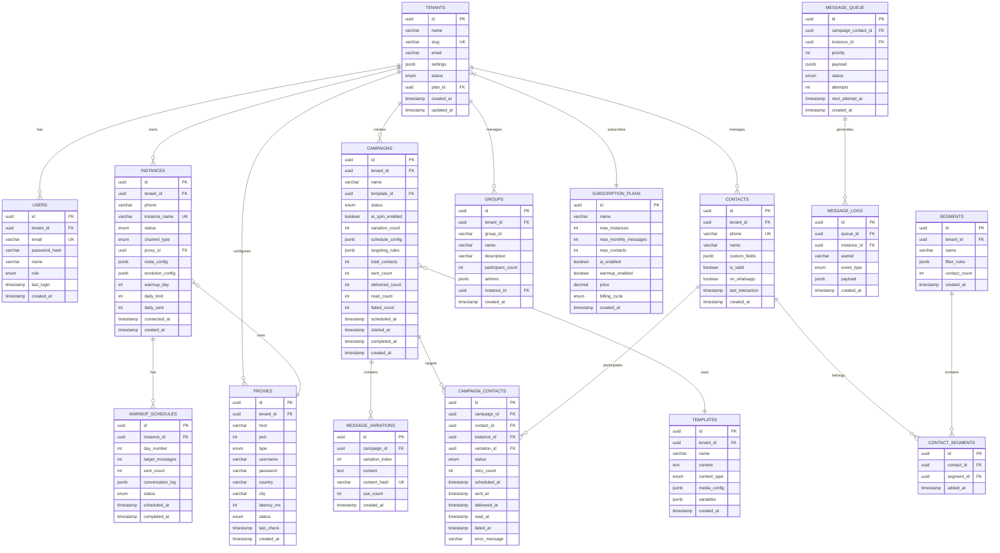

# WhatSaas - Especificação Técnica do Backend

> SaaS de Automação de WhatsApp Enterprise Híbrido

---

## 📋 Índice

1. [Diagrama ER](#1-diagrama-er)
2. [API Schema](#2-api-schema)
3. [Core Logic (Worker)](#3-core-logic-worker)
4. [Prompts de IA](#4-prompts-de-ia)

---

## 1. Diagrama ER (Entity Relationship)

### Visão Geral das Entidades



---

### Detalhamento das Tabelas Críticas

#### `instances` - Gestão de Chips/Instâncias

```sql
CREATE TABLE instances (
    id UUID PRIMARY KEY DEFAULT gen_random_uuid(),
    tenant_id UUID NOT NULL REFERENCES tenants(id) ON DELETE CASCADE,
    phone VARCHAR(20),
    instance_name VARCHAR(100) UNIQUE NOT NULL,
    
    -- Status: 'connecting', 'connected', 'disconnected', 'banned', 'warming'
    status VARCHAR(20) DEFAULT 'connecting',
    
    -- Channel: 'unofficial' (QR Code), 'official' (Meta Cloud API)
    channel_type VARCHAR(20) DEFAULT 'unofficial',
    
    -- Proxy Configuration
    proxy_id UUID REFERENCES proxies(id),
    
    -- Meta Cloud API Config (when channel_type = 'official')
    meta_config JSONB DEFAULT '{}',
    -- {
    --   "phone_number_id": "123456789",
    --   "waba_id": "987654321",
    --   "access_token": "encrypted_token"
    -- }
    
    -- Evolution API Config
    evolution_config JSONB DEFAULT '{}',
    -- {
    --   "instance_id": "abc123",
    --   "api_key": "encrypted_key",
    --   "webhook_url": "https://...",
    --   "fingerprint": { "user_agent": "...", "screen": "1920x1080" }
    -- }
    
    -- Warm-up Tracking
    warmup_day INT DEFAULT 0,
    daily_limit INT DEFAULT 10,
    daily_sent INT DEFAULT 0,
    
    -- Timestamps
    connected_at TIMESTAMP,
    created_at TIMESTAMP DEFAULT CURRENT_TIMESTAMP,
    updated_at TIMESTAMP DEFAULT CURRENT_TIMESTAMP,
    
    -- Constraints
    CONSTRAINT unique_phone_per_tenant UNIQUE (tenant_id, phone)
);

-- Index for load balancing queries
CREATE INDEX idx_instances_tenant_status ON instances(tenant_id, status) WHERE status = 'connected';
CREATE INDEX idx_instances_daily_capacity ON instances(tenant_id, daily_sent, daily_limit) WHERE status = 'connected';
```

#### `proxies` - Gestão de Proxies

```sql
CREATE TABLE proxies (
    id UUID PRIMARY KEY DEFAULT gen_random_uuid(),
    tenant_id UUID NOT NULL REFERENCES tenants(id) ON DELETE CASCADE,
    
    host VARCHAR(255) NOT NULL,
    port INT NOT NULL,
    type VARCHAR(10) DEFAULT 'socks5', -- 'socks5', 'http', 'https'
    username VARCHAR(100),
    password VARCHAR(255), -- encrypted
    
    -- Geolocation
    country VARCHAR(2),
    city VARCHAR(100),
    
    -- Health
    latency_ms INT,
    status VARCHAR(20) DEFAULT 'unknown', -- 'online', 'offline', 'slow'
    last_check TIMESTAMP,
    
    created_at TIMESTAMP DEFAULT CURRENT_TIMESTAMP,
    
    CONSTRAINT unique_proxy_per_tenant UNIQUE (tenant_id, host, port)
);
```

#### `message_variations` - Variações Geradas por IA

```sql
CREATE TABLE message_variations (
    id UUID PRIMARY KEY DEFAULT gen_random_uuid(),
    campaign_id UUID NOT NULL REFERENCES campaigns(id) ON DELETE CASCADE,
    
    variation_index INT NOT NULL,
    content TEXT NOT NULL,
    content_hash VARCHAR(64) NOT NULL, -- SHA256 for dedup
    
    use_count INT DEFAULT 0, -- Quantas vezes foi usada
    
    created_at TIMESTAMP DEFAULT CURRENT_TIMESTAMP,
    
    CONSTRAINT unique_variation_per_campaign UNIQUE (campaign_id, variation_index),
    CONSTRAINT unique_hash_per_campaign UNIQUE (campaign_id, content_hash)
);

-- Index for random selection
CREATE INDEX idx_variations_campaign ON message_variations(campaign_id, variation_index);
```

#### `warmup_schedules` - Agendamento de Maturação

```sql
CREATE TABLE warmup_schedules (
    id UUID PRIMARY KEY DEFAULT gen_random_uuid(),
    instance_id UUID NOT NULL REFERENCES instances(id) ON DELETE CASCADE,
    
    day_number INT NOT NULL, -- Dia do warm-up (1-14)
    target_messages INT NOT NULL, -- Meta de mensagens para o dia
    sent_count INT DEFAULT 0,
    
    -- Log das conversas simuladas
    conversation_log JSONB DEFAULT '[]',
    -- [
    --   { "to": "instance_xyz", "message": "Oi!", "sent_at": "..." },
    --   { "from": "instance_xyz", "message": "Tudo bem?", "received_at": "..." }
    -- ]
    
    status VARCHAR(20) DEFAULT 'pending', -- 'pending', 'running', 'completed'
    
    scheduled_at TIMESTAMP NOT NULL,
    completed_at TIMESTAMP,
    
    CONSTRAINT unique_day_per_instance UNIQUE (instance_id, day_number)
);
```

---

## 2. API Schema (REST Endpoints)

### Base URL
```
https://api.wathsaas.com/v1
```

### Autenticação
```
Authorization: Bearer <JWT_TOKEN>
X-Tenant-ID: <tenant_uuid>
```

---

### 2.1 Tenants & Auth

```yaml
# Registro de Tenant
POST /auth/register:
  body:
    name: string
    email: string
    password: string
    company_name: string
  response:
    tenant_id: uuid
    access_token: string
    refresh_token: string

# Login
POST /auth/login:
  body:
    email: string
    password: string
  response:
    access_token: string
    refresh_token: string
    tenant:
      id: uuid
      name: string
      plan: object

# Refresh Token
POST /auth/refresh:
  body:
    refresh_token: string
  response:
    access_token: string
```

---

### 2.2 Instances (Chips)

```yaml
# Listar Instâncias
GET /instances:
  query:
    status?: 'connected' | 'disconnected' | 'warming' | 'banned'
    page?: int
    limit?: int
  response:
    data: Instance[]
    pagination: { total, page, limit }

# Criar Instância (QR Code)
POST /instances:
  body:
    instance_name: string
    proxy_id?: uuid
    channel_type: 'unofficial' | 'official'
    meta_config?: { phone_number_id, waba_id, access_token }
  response:
    instance: Instance
    qr_code?: string # Base64 se unofficial

# Obter QR Code
GET /instances/:id/qr:
  response:
    qr_code: string # Base64
    status: 'pending' | 'scanned' | 'connected'

# Atualizar Instância
PATCH /instances/:id:
  body:
    proxy_id?: uuid
    daily_limit?: int
  response:
    instance: Instance

# Deletar Instância
DELETE /instances/:id:
  response:
    success: boolean

# Iniciar Warm-up
POST /instances/:id/warmup/start:
  body:
    duration_days: int # 7 ou 14
  response:
    schedule: WarmupSchedule[]

# Status do Warm-up
GET /instances/:id/warmup:
  response:
    current_day: int
    daily_limit: int
    daily_sent: int
    schedule: WarmupSchedule[]
```

---

### 2.3 Campaigns

```yaml
# Listar Campanhas
GET /campaigns:
  query:
    status?: 'draft' | 'scheduled' | 'running' | 'paused' | 'completed'
    page?: int
  response:
    data: Campaign[]
    pagination: object

# Criar Campanha
POST /campaigns:
  body:
    name: string
    template_id: uuid
    segment_ids?: uuid[]
    contact_ids?: uuid[]
    ai_spin_enabled: boolean
    variation_count?: int # default 20
    schedule_config?:
      scheduled_at: datetime
      timezone: string
  response:
    campaign: Campaign
    estimated_contacts: int

# Gerar Variações IA
POST /campaigns/:id/generate-variations:
  body:
    count: int # 1-50
    creativity: float # 0.0-1.0
    provider: 'openai' | 'anthropic' | 'ollama'
  response:
    variations: MessageVariation[]
    tokens_used: int

# Iniciar Campanha
POST /campaigns/:id/start:
  response:
    campaign: Campaign
    queued_messages: int

# Pausar Campanha
POST /campaigns/:id/pause:
  response:
    campaign: Campaign

# Retomar Campanha
POST /campaigns/:id/resume:
  response:
    campaign: Campaign

# Estatísticas da Campanha
GET /campaigns/:id/stats:
  response:
    total: int
    queued: int
    sent: int
    delivered: int
    read: int
    failed: int
    delivery_rate: float
    read_rate: float
```

---

### 2.4 Proxies

```yaml
# Listar Proxies
GET /proxies:
  query:
    status?: 'online' | 'offline' | 'slow'
  response:
    data: Proxy[]

# Adicionar Proxy
POST /proxies:
  body:
    host: string
    port: int
    type: 'socks5' | 'http'
    username?: string
    password?: string
    country?: string
  response:
    proxy: Proxy

# Importar Proxies (Bulk)
POST /proxies/import:
  body:
    proxies: string # host:port:user:pass por linha
    format: 'txt' | 'csv'
  response:
    imported: int
    failed: int
    errors: string[]

# Testar Proxy
POST /proxies/:id/test:
  response:
    status: 'online' | 'offline'
    latency_ms: int

# Testar Todos os Proxies
POST /proxies/test-all:
  response:
    job_id: uuid
    status: 'queued'
```

---

### 2.5 AI Content

```yaml
# Gerar Variações de Texto
POST /ai/spin:
  body:
    original_text: string
    count: int
    creativity: float
    preserve_variables: boolean # Manter {{nome}}, {{empresa}}
    provider: 'openai' | 'anthropic' | 'ollama'
  response:
    variations: string[]
    tokens_used: int
    cost_usd: float

# Gerar Roteiro de Warm-up
POST /ai/warmup-script:
  body:
    participant_count: int # Quantos chips vão conversar
    duration_minutes: int
    topics: string[] # ['casual', 'work', 'family']
  response:
    conversations: Conversation[]
    tokens_used: int
```

---

### 2.6 Messaging (Envio Direto)

```yaml
# Enviar Mensagem Única
POST /messages/send:
  body:
    instance_id: uuid
    to: string # Número de telefone
    content:
      type: 'text' | 'image' | 'video' | 'audio' | 'document'
      text?: string
      media_url?: string
      caption?: string
    simulate_typing: boolean
  response:
    message_id: uuid
    wamid: string
    status: 'queued' | 'sent'

# Webhook de Status (interno Evolution -> Backend)
POST /webhooks/evolution:
  body:
    instance: string
    event: 'message.sent' | 'message.delivered' | 'message.read' | 'message.failed'
    data: object
```

---

## 3. Core Logic (Worker)

### 3.1 Dispatcher Worker (TypeScript/NestJS + BullMQ)

```typescript
// src/modules/dispatcher/dispatcher.processor.ts

import { Processor, WorkerHost } from '@nestjs/bullmq';
import { Job } from 'bullmq';
import { Injectable, Logger } from '@nestjs/common';
import { InjectRepository } from '@nestjs/typeorm';
import { Repository, MoreThan } from 'typeorm';

import { Instance } from '../instances/entities/instance.entity';
import { CampaignContact } from '../campaigns/entities/campaign-contact.entity';
import { MessageVariation } from '../campaigns/entities/message-variation.entity';
import { Proxy } from '../proxies/entities/proxy.entity';
import { EvolutionApiService } from '../evolution/evolution-api.service';

interface DispatchJobData {
  tenantId: string;
  campaignContactId: string;
  campaignId: string;
}

@Processor('dispatch-queue')
@Injectable()
export class DispatcherProcessor extends WorkerHost {
  private readonly logger = new Logger(DispatcherProcessor.name);

  // Round-Robin state per tenant
  private instanceIndex = new Map<string, number>();

  constructor(
    @InjectRepository(Instance)
    private instanceRepo: Repository<Instance>,
    @InjectRepository(CampaignContact)
    private campaignContactRepo: Repository<CampaignContact>,
    @InjectRepository(MessageVariation)
    private variationRepo: Repository<MessageVariation>,
    @InjectRepository(Proxy)
    private proxyRepo: Repository<Proxy>,
    private evolutionApi: EvolutionApiService,
  ) {
    super();
  }

  async process(job: Job<DispatchJobData>): Promise<void> {
    const { tenantId, campaignContactId, campaignId } = job.data;
    
    this.logger.debug(`Processing job ${job.id} for contact ${campaignContactId}`);

    try {
      // 1. Buscar o registro do contato na campanha
      const campaignContact = await this.campaignContactRepo.findOne({
        where: { id: campaignContactId },
        relations: ['contact', 'campaign', 'campaign.template'],
      });

      if (!campaignContact) {
        throw new Error(`CampaignContact ${campaignContactId} not found`);
      }

      // 2. Selecionar Instância (Round-Robin com capacidade)
      const instance = await this.selectInstance(tenantId);
      if (!instance) {
        // Sem instância disponível, reagendar
        throw new Error('NO_AVAILABLE_INSTANCE');
      }

      // 3. Obter Proxy da Instância
      const proxy = instance.proxy;

      // 4. Sortear Variação de Texto (IA)
      const variation = await this.selectVariation(campaignId);

      // 5. Substituir Variáveis no Texto
      const finalContent = this.replaceVariables(
        variation.content,
        campaignContact.contact,
      );

      // 6. Aplicar Delay Aleatório (15-45 segundos)
      const delay = this.randomDelay(15000, 45000);
      await this.sleep(delay);

      // 7. Simular "Digitando..." (proporcional ao texto)
      const typingDuration = this.calculateTypingDuration(finalContent);
      await this.evolutionApi.sendPresence(
        instance.instanceName,
        campaignContact.contact.phone,
        'composing',
        typingDuration,
      );

      // 8. Enviar Mensagem via Evolution API
      const result = await this.evolutionApi.sendText(
        instance.instanceName,
        campaignContact.contact.phone,
        finalContent,
        proxy ? this.formatProxyUrl(proxy) : undefined,
      );

      // 9. Atualizar Status
      await this.campaignContactRepo.update(campaignContactId, {
        status: 'sent',
        instanceId: instance.id,
        variationId: variation.id,
        sentAt: new Date(),
      });

      // 10. Incrementar contadores
      await this.instanceRepo.increment({ id: instance.id }, 'dailySent', 1);
      await this.variationRepo.increment({ id: variation.id }, 'useCount', 1);

      this.logger.log(
        `Message sent: ${campaignContactId} via ${instance.phone} (delay: ${delay}ms)`,
      );

    } catch (error) {
      this.logger.error(`Failed to process ${campaignContactId}: ${error.message}`);
      
      // Atualizar como falha
      await this.campaignContactRepo.update(campaignContactId, {
        status: 'failed',
        errorMessage: error.message,
        failedAt: new Date(),
        retryCount: () => 'retry_count + 1',
      });

      // Re-throw para BullMQ gerenciar retry
      if (error.message === 'NO_AVAILABLE_INSTANCE') {
        throw error; // Vai para retry com backoff
      }
    }
  }

  /**
   * Seleção de Instância com Round-Robin e Verificação de Capacidade
   */
  private async selectInstance(tenantId: string): Promise<Instance | null> {
    // Buscar instâncias disponíveis (connected + capacidade)
    const instances = await this.instanceRepo.find({
      where: {
        tenantId,
        status: 'connected',
      },
      relations: ['proxy'],
      order: { dailySent: 'ASC' }, // Prioriza menos usadas
    });

    // Filtrar por capacidade diária
    const available = instances.filter(
      (inst) => inst.dailySent < inst.dailyLimit,
    );

    if (available.length === 0) {
      return null;
    }

    // Round-Robin
    const currentIndex = this.instanceIndex.get(tenantId) || 0;
    const selectedIndex = currentIndex % available.length;
    this.instanceIndex.set(tenantId, currentIndex + 1);

    return available[selectedIndex];
  }

  /**
   * Seleção Aleatória de Variação (Anti-Spam)
   */
  private async selectVariation(campaignId: string): Promise<MessageVariation> {
    const variations = await this.variationRepo.find({
      where: { campaignId },
    });

    if (variations.length === 0) {
      throw new Error('No variations found for campaign');
    }

    // Sortear aleatoriamente (poderia usar weighted random baseado em useCount)
    const randomIndex = Math.floor(Math.random() * variations.length);
    return variations[randomIndex];
  }

  /**
   * Substituir variáveis no template
   */
  private replaceVariables(template: string, contact: any): string {
    let result = template;
    
    // Variáveis padrão
    result = result.replace(/\{\{nome\}\}/gi, contact.name || 'Cliente');
    result = result.replace(/\{\{telefone\}\}/gi, contact.phone);
    
    // Variáveis customizadas
    if (contact.customFields) {
      for (const [key, value] of Object.entries(contact.customFields)) {
        const regex = new RegExp(`\\{\\{${key}\\}\\}`, 'gi');
        result = result.replace(regex, String(value));
      }
    }

    return result;
  }

  /**
   * Delay Aleatório entre min e max (em ms)
   */
  private randomDelay(min: number, max: number): number {
    return Math.floor(Math.random() * (max - min + 1)) + min;
  }

  /**
   * Calcular duração do "digitando" proporcional ao texto
   * ~50 palavras por minuto = ~4 caracteres por segundo
   */
  private calculateTypingDuration(text: string): number {
    const charsPerSecond = 4;
    const durationMs = (text.length / charsPerSecond) * 1000;
    return Math.min(durationMs, 10000); // Max 10 segundos
  }

  /**
   * Formatar URL do Proxy
   */
  private formatProxyUrl(proxy: Proxy): string {
    const auth = proxy.username 
      ? `${proxy.username}:${proxy.password}@` 
      : '';
    return `${proxy.type}://${auth}${proxy.host}:${proxy.port}`;
  }

  private sleep(ms: number): Promise<void> {
    return new Promise((resolve) => setTimeout(resolve, ms));
  }
}
```

---

### 3.2 Warmup Worker

```typescript
// src/modules/warmup/warmup.processor.ts

import { Processor, WorkerHost } from '@nestjs/bullmq';
import { Job } from 'bullmq';
import { Injectable, Logger } from '@nestjs/common';
import { InjectRepository } from '@nestjs/typeorm';
import { Repository } from 'typeorm';

import { Instance } from '../instances/entities/instance.entity';
import { WarmupSchedule } from './entities/warmup-schedule.entity';
import { AiService } from '../ai/ai.service';
import { EvolutionApiService } from '../evolution/evolution-api.service';

interface WarmupJobData {
  instanceId: string;
  partnerId: string; // Instância parceira para conversar
  scheduleId: string;
}

@Processor('warmup-queue')
@Injectable()
export class WarmupProcessor extends WorkerHost {
  private readonly logger = new Logger(WarmupProcessor.name);

  constructor(
    @InjectRepository(Instance)
    private instanceRepo: Repository<Instance>,
    @InjectRepository(WarmupSchedule)
    private scheduleRepo: Repository<WarmupSchedule>,
    private aiService: AiService,
    private evolutionApi: EvolutionApiService,
  ) {
    super();
  }

  async process(job: Job<WarmupJobData>): Promise<void> {
    const { instanceId, partnerId, scheduleId } = job.data;

    try {
      const [instance, partner] = await Promise.all([
        this.instanceRepo.findOne({ where: { id: instanceId } }),
        this.instanceRepo.findOne({ where: { id: partnerId } }),
      ]);

      if (!instance || !partner) {
        throw new Error('Instance or partner not found');
      }

      // Gerar conversa via IA
      const conversation = await this.aiService.generateWarmupConversation({
        participants: 2,
        messageCount: this.getMessageCountForDay(instance.warmupDay),
        topics: ['casual', 'work'],
      });

      // Executar conversa simulada
      for (const message of conversation) {
        const sender = message.role === 'A' ? instance : partner;
        const receiver = message.role === 'A' ? partner : instance;

        // Simular digitação
        const typingDuration = (message.content.length / 4) * 1000;
        await this.evolutionApi.sendPresence(
          sender.instanceName,
          receiver.phone,
          message.isAudio ? 'recording' : 'composing',
          Math.min(typingDuration, 8000),
        );

        // Delay natural
        await this.sleep(this.randomDelay(2000, 5000));

        // Enviar mensagem
        if (message.isAudio) {
          await this.evolutionApi.sendAudio(
            sender.instanceName,
            receiver.phone,
            await this.generateTTSAudio(message.content),
          );
        } else {
          await this.evolutionApi.sendText(
            sender.instanceName,
            receiver.phone,
            message.content,
          );
        }

        // Delay entre mensagens
        await this.sleep(this.randomDelay(10000, 30000));
      }

      // Atualizar schedule
      await this.scheduleRepo.update(scheduleId, {
        sentCount: () => `sent_count + ${conversation.length}`,
        conversationLog: () => `conversation_log || '${JSON.stringify(conversation)}'::jsonb`,
      });

      // Incrementar contadores
      await this.instanceRepo.increment({ id: instanceId }, 'dailySent', conversation.length);

      this.logger.log(
        `Warmup conversation completed: ${instance.phone} <-> ${partner.phone}`,
      );

    } catch (error) {
      this.logger.error(`Warmup failed: ${error.message}`);
      throw error;
    }
  }

  /**
   * Rampa de mensagens por dia de warm-up
   */
  private getMessageCountForDay(day: number): number {
    const ramp = [
      10, 15, 20, 25, 30, 40, 50, // Dias 1-7
      60, 70, 80, 90, 100, 100, 100, // Dias 8-14
    ];
    return ramp[Math.min(day - 1, ramp.length - 1)] || 10;
  }

  private randomDelay(min: number, max: number): number {
    return Math.floor(Math.random() * (max - min + 1)) + min;
  }

  private sleep(ms: number): Promise<void> {
    return new Promise((resolve) => setTimeout(resolve, ms));
  }

  private async generateTTSAudio(text: string): Promise<Buffer> {
    // Integrar com ElevenLabs ou OpenAI TTS
    return Buffer.from('audio_placeholder');
  }
}
```

---

### 3.3 Queue Configuration

```typescript
// src/config/bull.config.ts

import { BullModule } from '@nestjs/bullmq';

export const QueueConfig = BullModule.forRoot({
  connection: {
    host: process.env.REDIS_HOST || 'localhost',
    port: parseInt(process.env.REDIS_PORT) || 6379,
    password: process.env.REDIS_PASSWORD,
  },
  defaultJobOptions: {
    removeOnComplete: 1000,
    removeOnFail: 5000,
    attempts: 3,
    backoff: {
      type: 'exponential',
      delay: 5000, // 5s, 10s, 20s
    },
  },
});

export const QueueDefinitions = BullModule.registerQueue(
  { 
    name: 'dispatch-queue',
    defaultJobOptions: {
      attempts: 3,
      backoff: { type: 'exponential', delay: 10000 },
    },
  },
  { 
    name: 'warmup-queue',
    defaultJobOptions: {
      attempts: 2,
      backoff: { type: 'fixed', delay: 60000 },
    },
  },
  { 
    name: 'proxy-health-queue',
    defaultJobOptions: {
      attempts: 1,
    },
  },
);
```

---

## 4. Prompts de IA

### 4.1 Content Spinner Prompt

```typescript
// src/modules/ai/prompts/content-spinner.prompt.ts

export const CONTENT_SPINNER_SYSTEM_PROMPT = `
Você é um especialista em copywriting para WhatsApp marketing.
Sua tarefa é gerar variações semânticas de uma mensagem, mantendo:

1. **O mesmo significado e intenção** da mensagem original
2. **O mesmo tom** (formal, informal, amigável)
3. **Todas as variáveis** intactas (ex: {{nome}}, {{empresa}})
4. **O mesmo CTA** (call to action)

## REGRAS OBRIGATÓRIAS:

- Cada variação deve ser ÚNICA e diferente das outras
- Use sinônimos, mude a ordem das frases, varie a pontuação
- Mantenha o comprimento similar ao original (+/- 20%)
- NUNCA altere as variáveis {{...}}, copie-as exatamente
- Evite repetir estruturas de frase entre variações
- Use emojis de forma variada (alguns com mais, outros com menos)

## FORMATO DE SAÍDA:

Retorne um JSON array com as variações:

\`\`\`json
{
  "variations": [
    "Texto da variação 1...",
    "Texto da variação 2...",
    ...
  ]
}
\`\`\`
`;

export const contentSpinnerUserPrompt = (
  originalText: string,
  variationCount: number,
  creativity: number,
) => `
Gere ${variationCount} variações da seguinte mensagem de WhatsApp:

---
${originalText}
---

Nível de criatividade: ${creativity * 100}% (0% = conservador, 100% = muito criativo)

Retorne apenas o JSON, sem explicações.
`;
```

---

### 4.2 Warmup Conversation Generator

```typescript
// src/modules/ai/prompts/warmup-conversation.prompt.ts

export const WARMUP_CONVERSATION_SYSTEM_PROMPT = `
Você é um simulador de conversas naturais de WhatsApp brasileiro.
Sua tarefa é gerar diálogos realistas entre duas pessoas para maturação de chips.

## OBJETIVO:
Criar conversas que pareçam 100% humanas para evitar detecção de bots.

## REGRAS:

1. **Naturalidade**: Use gírias brasileiras, abreviações (vc, tb, pq, td), emojis
2. **Erros propositais**: Ocasionalmente inclua pequenos erros de digitação
3. **Variação de tamanho**: Misture mensagens curtas ("blz", "show") com médias
4. **Tempo verbal**: Use presente informal ("to chegando", "vou ver")
5. **Assuntos**: Conversa casual, trabalho, família, eventos, clima
6. **Áudios**: Marque mensagens que seriam melhor como áudio com [AUDIO]

## PERSONAGENS:
- Pessoa A: Mais extrovertida, inicia assuntos
- Pessoa B: Mais reservada, responde com interesse

## FORMATO DE SAÍDA:

\`\`\`json
{
  "conversation": [
    { "role": "A", "content": "E aí, blz?", "isAudio": false },
    { "role": "B", "content": "Opa, td certo e vc?", "isAudio": false },
    { "role": "A", "content": "[AUDIO] Cara, deixa eu te contar o que aconteceu ontem...", "isAudio": true },
    ...
  ]
}
\`\`\`
`;

export const warmupConversationUserPrompt = (
  messageCount: number,
  topics: string[],
) => `
Gere uma conversa natural de WhatsApp com ${messageCount} mensagens no total.

Tópicos sugeridos: ${topics.join(', ')}

A conversa deve parecer 100% orgânica, como se fossem amigos conversando.
Inclua pelo menos 2-3 mensagens marcadas como áudio.

Retorne apenas o JSON.
`;
```

---

### 4.3 AI Service Implementation

```typescript
// src/modules/ai/ai.service.ts

import { Injectable, Logger } from '@nestjs/common';
import { ConfigService } from '@nestjs/config';
import OpenAI from 'openai';
import Anthropic from '@anthropic-ai/sdk';

import {
  CONTENT_SPINNER_SYSTEM_PROMPT,
  contentSpinnerUserPrompt,
} from './prompts/content-spinner.prompt';
import {
  WARMUP_CONVERSATION_SYSTEM_PROMPT,
  warmupConversationUserPrompt,
} from './prompts/warmup-conversation.prompt';

@Injectable()
export class AiService {
  private readonly logger = new Logger(AiService.name);
  private openai: OpenAI;
  private anthropic: Anthropic;

  constructor(private config: ConfigService) {
    this.openai = new OpenAI({
      apiKey: config.get('OPENAI_API_KEY'),
    });
    this.anthropic = new Anthropic({
      apiKey: config.get('ANTHROPIC_API_KEY'),
    });
  }

  async generateVariations(
    originalText: string,
    count: number,
    creativity: number = 0.7,
    provider: 'openai' | 'anthropic' = 'openai',
  ): Promise<{ variations: string[]; tokensUsed: number }> {
    const userPrompt = contentSpinnerUserPrompt(originalText, count, creativity);

    if (provider === 'openai') {
      const response = await this.openai.chat.completions.create({
        model: 'gpt-4o',
        messages: [
          { role: 'system', content: CONTENT_SPINNER_SYSTEM_PROMPT },
          { role: 'user', content: userPrompt },
        ],
        temperature: creativity,
        response_format: { type: 'json_object' },
      });

      const result = JSON.parse(response.choices[0].message.content);
      return {
        variations: result.variations,
        tokensUsed: response.usage?.total_tokens || 0,
      };

    } else {
      const response = await this.anthropic.messages.create({
        model: 'claude-3-5-sonnet-20241022',
        max_tokens: 4096,
        system: CONTENT_SPINNER_SYSTEM_PROMPT,
        messages: [{ role: 'user', content: userPrompt }],
      });

      const content = response.content[0];
      if (content.type === 'text') {
        const jsonMatch = content.text.match(/\{[\s\S]*\}/);
        if (jsonMatch) {
          const result = JSON.parse(jsonMatch[0]);
          return {
            variations: result.variations,
            tokensUsed: response.usage.input_tokens + response.usage.output_tokens,
          };
        }
      }
      throw new Error('Failed to parse AI response');
    }
  }

  async generateWarmupConversation(options: {
    participants: number;
    messageCount: number;
    topics: string[];
  }): Promise<Array<{ role: string; content: string; isAudio: boolean }>> {
    const userPrompt = warmupConversationUserPrompt(
      options.messageCount,
      options.topics,
    );

    const response = await this.openai.chat.completions.create({
      model: 'gpt-4o',
      messages: [
        { role: 'system', content: WARMUP_CONVERSATION_SYSTEM_PROMPT },
        { role: 'user', content: userPrompt },
      ],
      temperature: 0.9, // Alta criatividade para parecer natural
      response_format: { type: 'json_object' },
    });

    const result = JSON.parse(response.choices[0].message.content);
    return result.conversation;
  }
}
```

---

## 📊 Resumo dos Entregáveis

| Entregável | Status | Descrição |
|------------|--------|-----------|
| Diagrama ER | ✅ | 15+ tabelas com relacionamentos |
| API Schema | ✅ | 30+ endpoints REST documentados |
| Dispatcher Worker | ✅ | Round-robin, rate limiting, variações |
| Warmup Worker | ✅ | Conversas simuladas, rampa progressiva |
| Prompts IA | ✅ | Content Spinner + Warmup Generator |
| Queue Config | ✅ | BullMQ com retry e backoff |

---

> 📝 **Próximos Passos**: Implementar os módulos no backend NestJS seguindo esta especificação.
